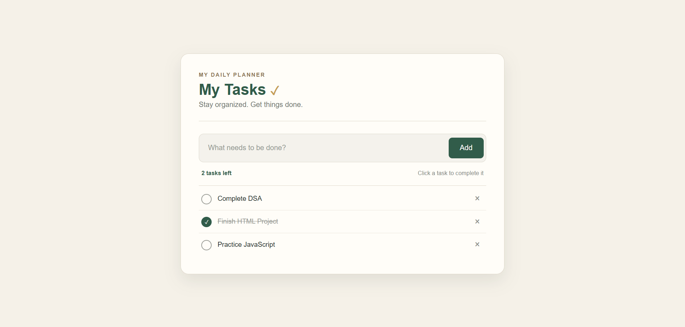

# 📝 To-Do List – HTML, CSS & JavaScript

A simple and responsive To-Do List web application built using **HTML, CSS and JavaScript**.

## 🚀 Features

* Add new tasks
* Mark tasks as completed
* Delete tasks
* Save tasks using browser Local Storage
* Tasks remain available after refreshing the page
* Simple and clean user interface

## 🛠️ Technologies Used

* HTML5
* CSS3
* JavaScript
* Local Storage

## 📂 Project Structure

```text
todo-list-html-css-js/
│
├── index.html
├── style.css
├── script.js
├── images/
│   ├── icon.png
│   ├── checked.png
│   └── unchecked.png
└── README.md
```

## ⚙️ How It Works

1. Enter a task in the input box.
2. Click the **Add** button.
3. Click a task to mark it as completed.
4. Click the **×** button to delete a task.
5. Tasks are stored in the browser using **Local Storage**.

## 💻 How to Run

1. Download or clone this repository.
2. Open the project folder.
3. Open `index.html` in a web browser.

## 📸 Project Preview

Add screenshots of your application here.

## 🎯 Learning Outcomes

Through this project, I practiced:

* HTML page structure
* CSS styling and layout
* JavaScript DOM manipulation
* Event handling
* Local Storage
* Basic frontend project organization

 ## 🌐 Live Demo

[Click here to try the To-Do List](https://Devanshi-Tech3158.github.io/TODO-LIST-HTML-CSS-JS/)

## 📸 Project Preview



## 👩‍💻 Author
Devanshi

GitHub: Devanshi-Tech3158
